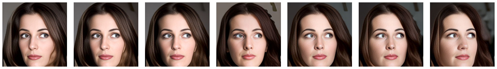
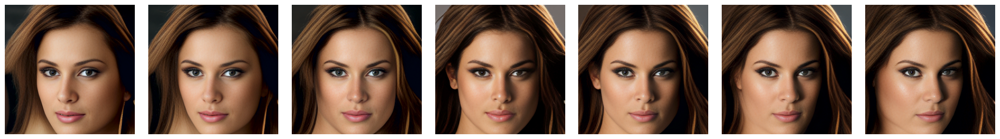
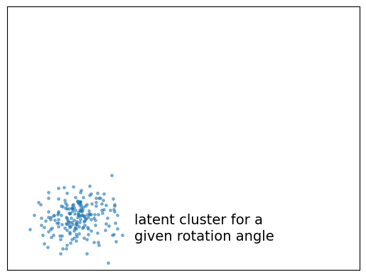
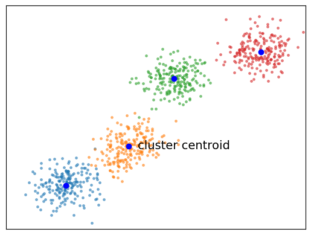
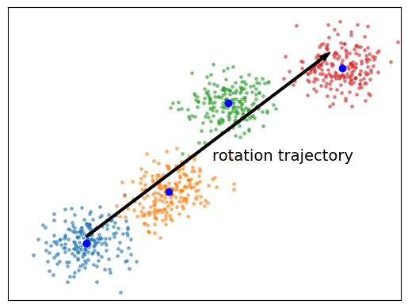
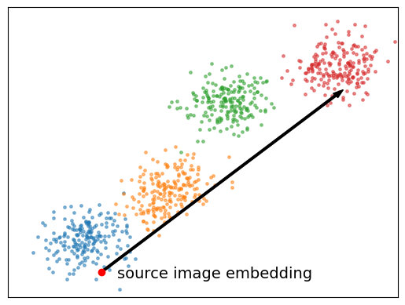
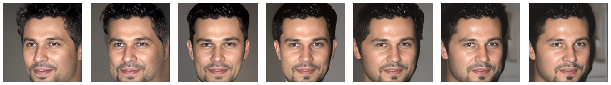
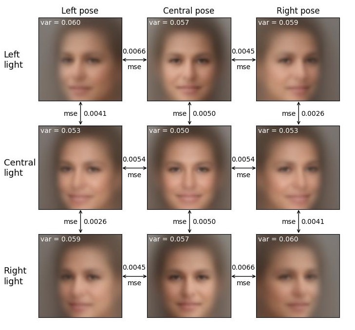
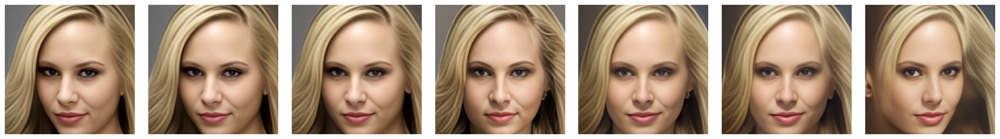

# Head-Rotation
This is a companion repository to the article "Head Rotation in Denoising Diffusion Models", joint work with Gabriele Colasuonno and Antonio Guerra.

  

Denoising Diffusion Models (DDM) are currently at the forefront of cutting-edge technology in deep generative modeling. However, effectively exploring the underlying meaning in the latent space and identifying compelling paths for manipulating and editing important attributes of generated samples remains a challenge, mainly due to the high dimensionality of the latent space.

In this research, our focus is specifically on face rotation, which is recognized as one of the most complex editing operations. By utilizing a recent embedding technique for Denoising Diffusion Implicit Models (DDIM), we have achieved remarkable manipulations covering a wide rotation angle of up to $\pm 30^o$, while preserving the distinct characteristics of each individual.

Our methodology involves computing trajectories that approximate clusters of latent representations from dataset samples with various yaw rotations through linear regression. These trajectories are obtained by analyzing subsets of data that share significant attributes with the source image.

One of these critical attributes is the light provenance: as a byproduct of our research, we have labeled the CelebA dataset, categorizing images into three major groups based on the illumination direction: left, center, and right.

  

<h2>Methodology</h2>
The problem consists in finding trajectories in the latent spaces corresponding to left/right rotations of the head. We restricted the analysis to linear trajectories, however, a single direction does not seem to correctly approximate large rotations, and we split the problem along two main directions, one for the right rotation and another one for the left rotation. 

For a fixed direction (left or right), the approach is schematically described in the following picture

  <table>
    <tr>
      <td>(a)</td>
      <td>(b)</td>
      <td>(c)</td>
      <td>(d)</td>
    </tr>
  </table>

Given a rotation yaw angle $\Theta$, we retrieve from the dataset a large number of images with a yaw close to $\Theta$; the precise way this set is selected will be discused below. This set is then embedded into the latent space, producing the 
cluster of points emphasized in picture (a). Next (b), we repeat this operation with increasing angles $\Theta_1, \dots \Theta_n$ and compute the centroids of
the corresponding clusters. We then fit by linear regression a line though the centroids (c), 
giving a direction corresponding to the rotation. Finally, we move along the
computed direction starting form the specific point corresponding to the embedding of the source image (d). Of course, latent points are then projected into the visible domain using the generator.

We prefer to compute centroids instead of directly fitting over all clusters for computational reasons. 

  

<h2>Selection of CelebA images</h2>
In our first attempts, we selected images from the dataset just using the rotation.

Instead, it looks important to select images having at least a rough similarity
with the source image we want to act on. A particularly important information is the illumination direction, that is an attribute not available for CelebA. 
We addressed this lack producing our own labeling; specifically, we categorized CelebA images into three major groups based on their main source of illumination: left, center, and right. The labeling process was carried out in a semi-supervised manner with the collaboration of many students. 

In the picture below, we summarise the outcome of our labeling and the complex interplay between illumination and orientation by showing the mean faces corresponding to different light sources and poses.

  

The different provenance of the light is still clearly recognizable in the centroids, implicitly testifying the quality of our labeling. Note also
the complex interplay between illumination and pose.

  

